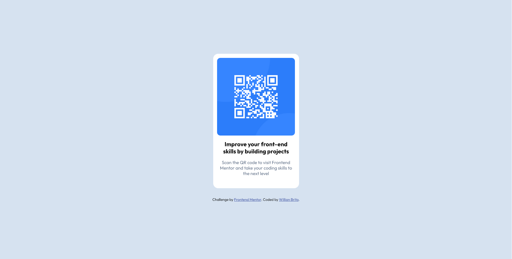

# Frontend Mentor - QR code component solution

This is a solution to the [QR code component challenge on Frontend Mentor](https://www.frontendmentor.io/challenges/qr-code-component-iux_sIO_H). 

## Table of contents

- [Overview](#overview)
  - [Screenshot](#screenshot)
  - [Links](#links)
- [My process](#my-process)
  - [Built with](#built-with)
  - [Continued development](#continued-development)
- [Author](#author)

## Overview

### Screenshot

### Links

- Solution URL: https://www.frontendmentor.io/solutions/qr-code-card-with-html-and-css-7pgqJcw6Fr
- Live Site URL: https://kennedy-brito.github.io/qr-code-component/

## My process

### Built with

- Semantic HTML5 markup
- CSS custom properties

### Continued development

I want to practice more the centering of elements in a page, i found strange how `margin: auto;` didn't center vertically

## Author

- Frontend Mentor - [@kennedy-brito](https://www.frontendmentor.io/profile/kennedy-brito)
